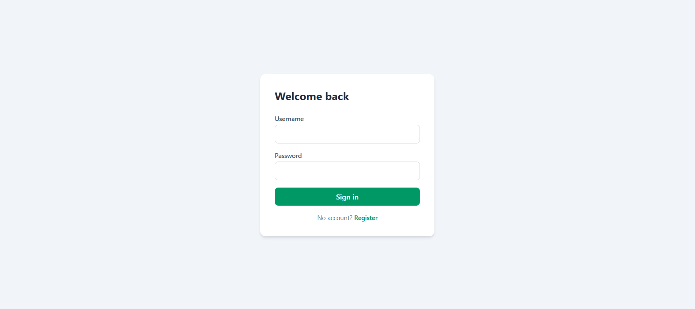
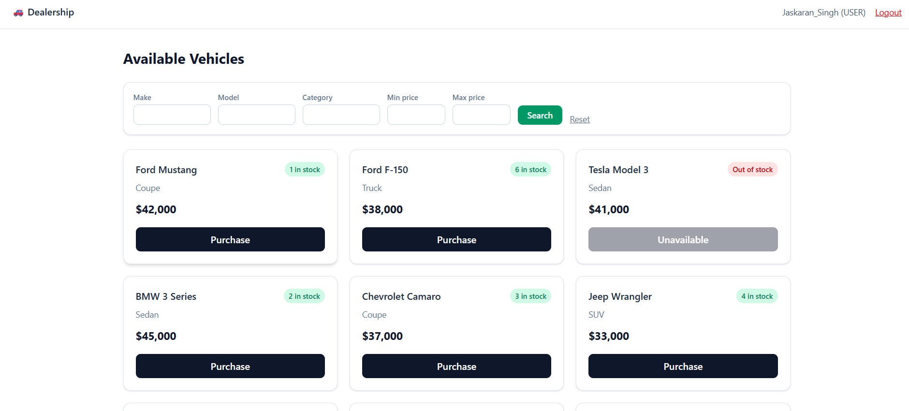
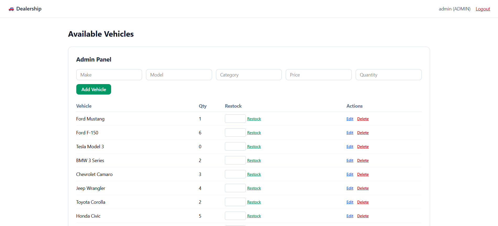
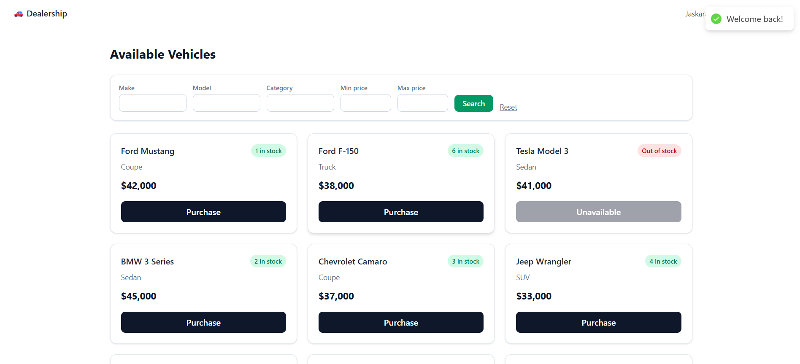

# 🚗 Car Dealership Inventory System

A full-stack car dealership inventory management system with JWT authentication, role-based access control (admin/user), vehicle CRUD, search/filtering, and purchase/restock workflows.

## Features

- User registration and login with JWT-based authentication
- Role-based access: regular users can browse and purchase; admins can add, edit, delete, and restock vehicles
- Vehicle inventory with make, model, category, price, and quantity
- Search and filter vehicles by make, model, category, and price range
- Purchase flow that decrements stock, disabled automatically when out of stock
- Admin panel for full vehicle management
- Toast notifications and loading states across the app
- Responsive, Tailwind-styled UI

## Tech Stack

**Backend:** Django, Django REST Framework, djangorestframework-simplejwt, PostgreSQL, pytest + pytest-django, django-cors-headers

**Frontend:** React (Vite), TypeScript, Tailwind CSS v4, Axios, React Router DOM, React Context API, react-hot-toast

## Project Structure

```
car-dealership/
├── backend/
│   ├── config/          # Django project settings, URLs
│   ├── users/            # Custom User model, auth (register/login)
│   ├── vehicles/         # Vehicle model, CRUD, search, purchase/restock
│   └── manage.py
├── frontend/
│   ├── src/
│   │   ├── api/          # Axios client, typed API functions
│   │   ├── context/      # AuthContext
│   │   ├── components/   # VehicleCard, SearchBar, AdminPanel
│   │   └── pages/        # LoginPage, RegisterPage, DashboardPage
│   └── package.json
├── docs/screenshots/
├── PROMPTS.md
└── README.md
```

## Setup Instructions

### Prerequisites

- Python 3.10+
- Node.js 18+
- PostgreSQL 14+

### Backend Setup

```bash
cd backend
python3 -m venv venv
source venv/bin/activate   # Windows: venv\Scripts\activate

pip install -r requirements.txt
```

Create the PostgreSQL database and user:

```bash
sudo -u postgres psql
```
```sql
CREATE DATABASE dealership_db;
CREATE USER dealership_user WITH PASSWORD 'dealership_pass';
GRANT ALL PRIVILEGES ON DATABASE dealership_db TO dealership_user;
ALTER USER dealership_user CREATEDB;
\q
```

Create `backend/.env`:

```
SECRET_KEY=your-secret-key-here
DEBUG=True
DB_NAME=dealership_db
DB_USER=dealership_user
DB_PASSWORD=dealership_pass
DB_HOST=localhost
DB_PORT=5432
```

Run migrations, seed sample data, and start the server:

```bash
python manage.py migrate
python manage.py seed_data
python manage.py runserver
```

Backend runs at `http://localhost:8000`.

**Seeded accounts:**
| Role | Username | Password |
|---|---|---|
| Admin | `admin` | `admin123` |
| User | `user` | `user123` |

### Frontend Setup

```bash
cd frontend
npm install
```

Create `frontend/.env`:

```
VITE_API_URL=http://localhost:8000/api
```

```bash
npm run dev
```

Frontend runs at `http://localhost:5173`.

## API Endpoints

| Method | Endpoint | Description | Access |
|---|---|---|---|
| POST | `/api/auth/register` | Register a new user | Public |
| POST | `/api/auth/login` | Log in, returns JWT tokens | Public |
| GET | `/api/vehicles/` | List all vehicles | Authenticated |
| POST | `/api/vehicles/` | Add a vehicle | Authenticated |
| GET | `/api/vehicles/search` | Search/filter vehicles | Authenticated |
| PUT | `/api/vehicles/:id` | Update a vehicle | Authenticated |
| DELETE | `/api/vehicles/:id` | Delete a vehicle | Admin only |
| POST | `/api/vehicles/:id/purchase` | Purchase a vehicle (decrements stock) | Authenticated |
| POST | `/api/vehicles/:id/restock` | Restock a vehicle (increments stock) | Admin only |

## Running Tests

```bash
cd backend
python -m pytest --cov=users --cov=vehicles --cov-report=term-missing
```

### Test Report

```
16 passed
users/tests.py::TestRegister::test_register_success PASSED
users/tests.py::TestRegister::test_register_duplicate_email PASSED
users/tests.py::TestLogin::test_login_success PASSED
users/tests.py::TestLogin::test_login_wrong_password PASSED
vehicles/tests.py::TestVehicleListCreate::test_create_vehicle_authenticated PASSED
vehicles/tests.py::TestVehicleListCreate::test_create_vehicle_unauthenticated PASSED
vehicles/tests.py::TestVehicleListCreate::test_list_vehicles PASSED
vehicles/tests.py::TestVehicleSearch::test_search_by_make PASSED
vehicles/tests.py::TestVehicleSearch::test_search_by_price_range PASSED
vehicles/tests.py::TestVehicleUpdateDelete::test_update_vehicle PASSED
vehicles/tests.py::TestVehicleUpdateDelete::test_delete_vehicle_as_admin PASSED
vehicles/tests.py::TestVehicleUpdateDelete::test_delete_vehicle_as_non_admin_forbidden PASSED
vehicles/tests.py::TestVehiclePurchaseRestock::test_purchase_decreases_quantity PASSED
vehicles/tests.py::TestVehiclePurchaseRestock::test_purchase_fails_when_out_of_stock PASSED
vehicles/tests.py::TestVehiclePurchaseRestock::test_restock_as_admin PASSED
vehicles/tests.py::TestVehiclePurchaseRestock::test_restock_as_non_admin_forbidden PASSED
vehicles/tests.py::TestVehiclePurchaseRestock::test_restock_rejects_non_positive_amount PASSED

TOTAL coverage: 92%
```

## Screenshots

| Login | Dashboard (User) |
|---|---|
|  |  |

| Dashboard (Admin) | Toast Notification |
|---|---|
|  |  |

## My AI Usage

**AI tool used:** Claude (Anthropic), via the Claude.ai chat interface.

**How it was used:**

I drove the overall architecture and sequencing of the build myself — I had an existing 2-day workflow plan (backend TDD first, then frontend, then polish and docs) and used Claude as an execution partner within that plan rather than letting it freewheel. Specifically:

- **Stack decision:** I chose Django + DRF + Simple JWT + PostgreSQL for the backend and React + Vite + Tailwind + Axios + React Router + Context for the frontend, based on my own prior work experience with this stack, and had Claude adapt its original Node/Prisma-based plan to match.
- **Sequencing and scope:** I directed the order of work phase by phase (auth first, then vehicle CRUD, then seed data, then frontend pages in a specific order: auth pages -> dashboard -> admin panel -> polish), and told Claude explicitly what each phase needed to satisfy from the assignment brief (e.g. which endpoints, which permissions, disabled purchase button at zero stock, admin-only delete/restock).
- **Prompting for TDD discipline and commit hygiene:** I pushed for the Red-Green-Refactor pattern to actually show up cleanly in git history, and caught and corrected several places where commits got duplicated or mixed up -- I did the actual git surgery (interactive rebase, soft resets, re-staging into correct groups) myself, running each command and verifying output before proceeding.
- **Running and validating everything locally:** All code was executed, tested, and debugged on my own WSL machine -- I ran every migration, test suite, and dev server myself, and reported back real error output (Postgres permission errors, stale JWT causing 401s, TypeScript resolution issues) that Claude then diagnosed.
- **QA and review:** I reviewed the running app in the browser at each stage (auth flow, dashboard, admin panel, purchase/restock) and caught issues from actual usage -- including a negative-restock value I noticed while testing the admin panel, which led to a validation fix and a new test.
- **AI's role:** Within that structure, Claude generated boilerplate (serializers, views, React components), wrote the test scaffolding to match my TDD requirement, and helped debug issues once I supplied the actual terminal/browser output.

**Reflection:**

The biggest win wasn't code generation -- it was using Claude as a fast execution layer once I'd already decided the stack, sequencing, and what "done" looked like for each phase. Because I came in with a clear plan and prior experience with the Django/DRF stack, I could tell quickly when generated code didn't match what I wanted and redirect it, rather than accepting whatever came out first. The debugging loop was where it helped most: pasting raw errors (Postgres CREATEDB permission issue, the stale-JWT-on-login bug, a Tailwind v4 breaking change) got targeted fixes fast instead of me trawling docs. That said, I still had to own the git history personally -- AI-assisted terminal work is error-prone with copy-paste commit messages, and for an assignment where commit history is graded, I made sure to verify and manually fix it (interactive rebase, re-grouping commits) rather than trusting it blindly. Overall it compressed the boilerplate-heavy parts of a 2-day timeline significantly while leaving the decisions and verification to me.

---

*Built as part of a TDD kata assignment. See `PROMPTS.md` for the full AI chat log used in development.*